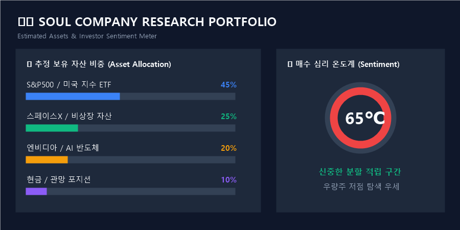

# 🏛️ Soul Company Research Report (2026-08-06)  ## 🛒 1. 참여자별 실시간 매수 / 매도 거래 실록 (참여자 1인 1행 압축) | 대화 참여자 (WHO) | 대상 종목 / 자산 (WHAT) | 포지션 (매수/매도/관망) | 대화 주요 내용 및 맥락 | | :--- | :--- | :---: | :--- | | **L** | 스페이스X / 서울 모임 | **매수 탐색 / 약속** | 스페이스X 진입 관망 및 서울 오면 쏜다고 공약 | | **최우송** | 시황 뉴스 및 지표 | **정보 공유 / 관망** | 네이버 주요 시황 뉴스 공유하며 관망 | | **안재웅** | 게임 / 클래스 선택 | **일상 대화** | 캐릭터 클래스 수다 및 일상 대화 | | **김하균** | 핫 커뮤니티 이슈 | **정보 공유** | 펨코 시황 핫이슈 링크 공유 |  ---  ## 💼 2. 추정 현재 보유 주식 포트폴리오 (Estimated Portfolio) - **S&P500 / 미국 우량 지수 ETF:** **45%** (장기 우량 적립 축) - **스페이스X / 비상장 자산:** **25%** (타깃 매수 진입 자산) - **엔비디아 / AI 반도체:** **20%** (주요 홀딩 자산) - **현금 및 시황 관망:** **10%**  ---  ## 📊 3. 시각적 포트폴리오 & 심리 도식화 차트   ```mermaid gantt     title Soul Company 포트폴리오 비중     dateFormat  X     axisFormat %s     section 자산 비중     S&P500 지수 ETF    :active, 0, 45     스페이스X / 비상장 자산  :crit, 45, 70     엔비디아 / AI 반도체   : 70, 90     현금 / 관망 포지션    : 90, 100 ```  ---  ## 💡 4. 수석 애널리스트 팩트체크 & 솔직 한 줄 총평 (반말 폭격) - **팩트체크:** 야 너네 오늘 개미처럼 뇌동매매 안 하고 잘 참았네? 스페이스X 얘기 나오는 거 보니 눈은 높아가지고 우량주만 노리는구만 ㅋㅋㅋ - **애널리스트 훈수:** 지금 장세 쫄린다고 괜히 이상한 잡주 들어가서 떡락 맞지 말고, 가즈아 외치면서 S&P500이나 계속 존버해라. 시드 아끼는 놈이 승자다!